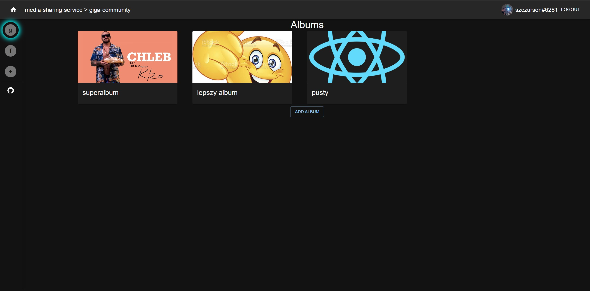
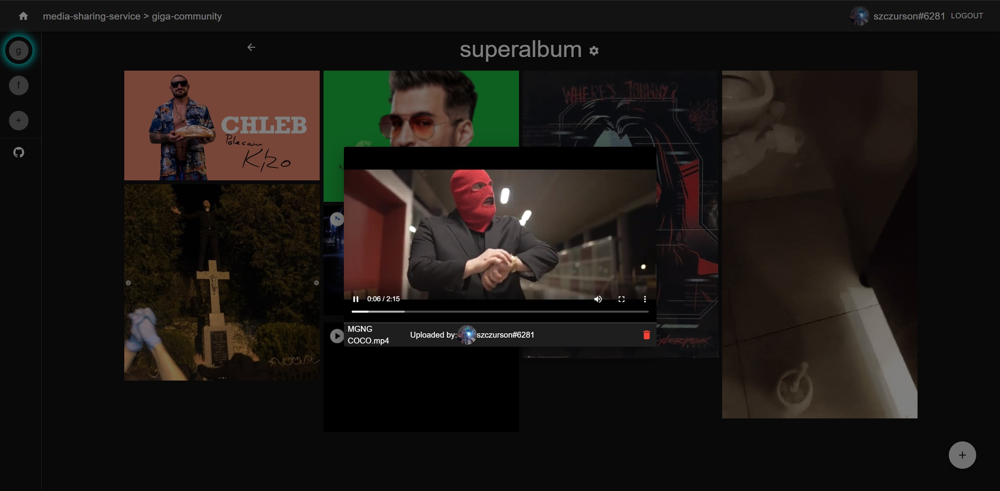

# media-sharing-service
Service for sharing media (images/videos) with other people

  
## [Live demo](http://adhesive-invention.surge.sh/)
⚠️ Live Demo doesn't use HTTPS  
❗ **Logging in with Google is disabled for easier showcasing: use mock login option**  
  
Invite to example commmunity: [qKXQ1sf-](http://adhesive-invention.surge.sh/i/qKXQ1sf-) (maxUses: inf, expires: never)
### Live demo deployment details
- React frontend: [surge.sh](https://surge.sh/)
- Node.js backend: Google Cloud Compute Engine instance
- Database: sqlite3 file database
- File Storage: Google Cloud Storage
## Features
You can:
- Share images and videos with selected group of people (communities)
- Organize images and videos into albums
- Login with multiple OAuth2 Providers
- Control other users permissions as community owner (allow/disallow uploading)
## Technologies/Libraries used:
- [Web frontend](web/README.md): (/web)
  - React 18 (through [Create React App](https://github.com/facebook/create-react-app))
  - Typescript
  - Material UI v5
  - Redux
  - React Router v6
- [Backend service](backend/README.md): (/backend)
  - Node.js 18
  - Typescript
  - Express.js
  - TypeORM (sqlite, mariadb)
  - Google Cloud Storage
  - JWT
  - Jest